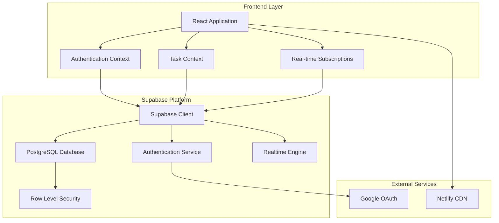
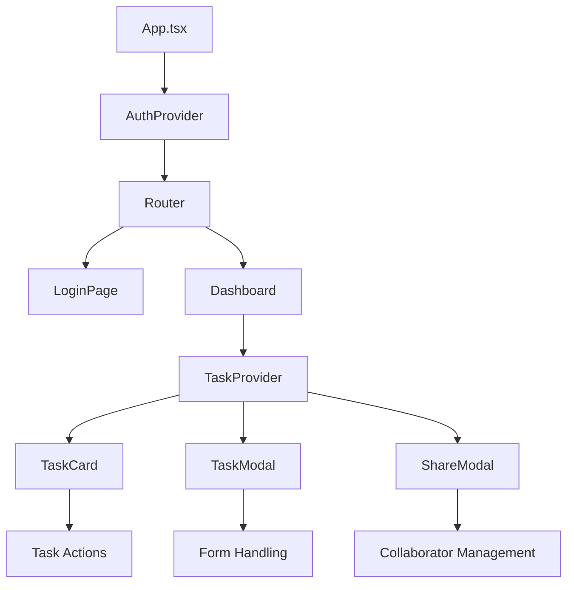
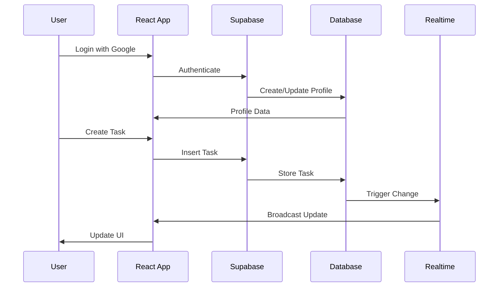
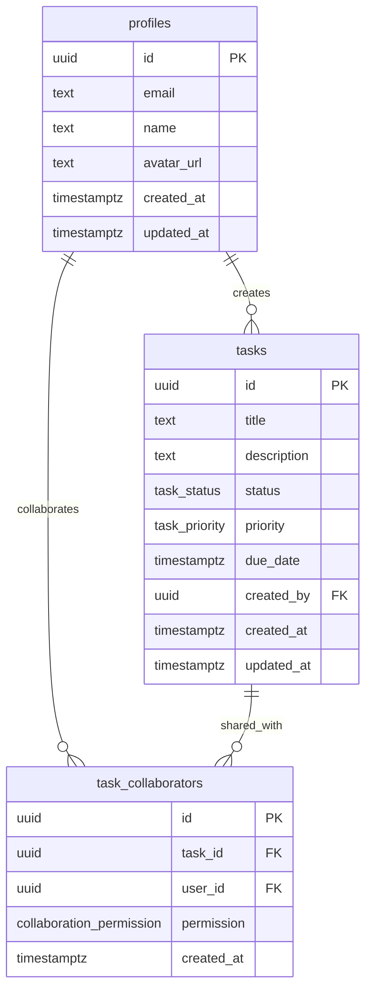
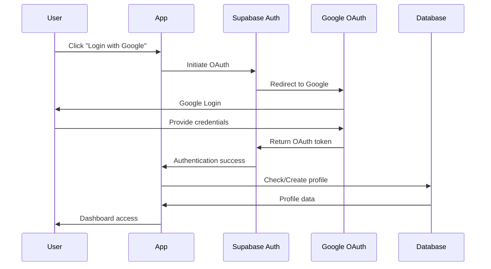
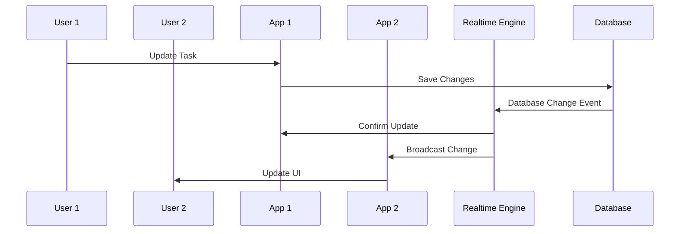
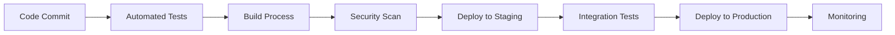

# TaskFlow Architecture Documentation

## Overview

TaskFlow is a modern, real-time task management application built with React and Supabase. The architecture emphasizes real-time collaboration, security, and scalability.

## System Architecture



## Component Architecture

### Frontend Components



### Data Flow



## Database Schema

### Entity Relationship Diagram



### Database Design Principles

1. **Normalization**: Proper 3NF structure to reduce redundancy
2. **Indexing**: Strategic indexes for performance
3. **Constraints**: Foreign key relationships for data integrity
4. **Security**: Row Level Security for access control

## Security Architecture

### Authentication Flow



### Row Level Security (RLS)

1. **Profile Access**:
   - Users can read all profiles (for sharing)
   - Users can only update their own profile

2. **Task Access**:
   - Users can read their own tasks
   - Users can read tasks shared with them
   - Users can update tasks they own or have write access to

3. **Collaboration Access**:
   - Task owners can manage collaborators
   - Collaborators can view collaboration details

## Real-time Architecture

### WebSocket Implementation



### Subscription Management

- **Channel-based subscriptions**: Separate channels for different data types
- **Automatic reconnection**: Built-in reconnection logic
- **Optimistic updates**: Immediate UI updates with rollback capability

## Performance Optimization

### Frontend Optimization

1. **Code Splitting**:
   - Route-based splitting
   - Component lazy loading
   - Dynamic imports

2. **State Management**:
   - Context API for global state
   - Local state for component-specific data
   - Memoization for expensive computations

3. **Caching Strategy**:
   - Supabase client-side caching
   - Browser storage for user preferences
   - Query result caching

### Backend Optimization

1. **Database Indexes**:
   ```sql
   -- Key indexes for performance
   CREATE INDEX idx_tasks_created_by ON tasks(created_by);
   CREATE INDEX idx_tasks_status ON tasks(status);
   CREATE INDEX idx_tasks_due_date ON tasks(due_date);
   CREATE INDEX idx_task_collaborators_task_id ON task_collaborators(task_id);
   ```

2. **Query Optimization**:
   - Select only required fields
   - Use joins efficiently
   - Implement pagination for large datasets

3. **Connection Management**:
   - Connection pooling
   - Prepared statements
   - Connection timeout handling

## Scalability Considerations

### Horizontal Scaling

1. **Database Scaling**:
   - Read replicas for read-heavy workloads
   - Connection pooling for high concurrency
   - Sharding strategies for large datasets

2. **Application Scaling**:
   - Stateless application design
   - CDN for static assets
   - Load balancing for multiple instances

### Vertical Scaling

1. **Resource Optimization**:
   - Memory usage optimization
   - CPU-intensive task optimization
   - Network bandwidth optimization

## Error Handling Strategy

### Frontend Error Handling

```typescript
// Global error boundary
class ErrorBoundary extends React.Component {
  // Handle React errors
}

// API error handling
try {
  await supabase.from('tasks').select('*');
} catch (error) {
  toast.error('Failed to load tasks');
  // Log error for monitoring
}
```

### Backend Error Handling

- **Database constraints**: Prevent invalid data
- **RLS policies**: Automatic authorization checks
- **Validation**: Server-side input validation

## Monitoring and Observability

### Metrics Collection

1. **Application Metrics**:
   - User authentication success/failure rates
   - Task creation/update rates
   - Real-time connection status
   - Error rates and types

2. **Database Metrics**:
   - Query performance
   - Connection pool usage
   - Lock contention
   - Index usage

3. **Infrastructure Metrics**:
   - Response times
   - Throughput
   - Error rates
   - Resource utilization

### Logging Strategy

1. **Application Logs**:
   - User actions
   - Error events
   - Performance metrics
   - Security events

2. **Database Logs**:
   - Slow queries
   - Connection events
   - Security violations
   - Backup status

## Security Considerations

### Data Protection

1. **Encryption**:
   - Data at rest encryption
   - Data in transit encryption (TLS)
   - Key management

2. **Access Control**:
   - Role-based access control
   - Principle of least privilege
   - Regular access reviews

3. **Input Validation**:
   - Client-side validation
   - Server-side validation
   - SQL injection prevention

### Compliance

1. **GDPR Compliance**:
   - Data minimization
   - Right to deletion
   - Data portability
   - Privacy by design

2. **Security Best Practices**:
   - Regular security audits
   - Vulnerability scanning
   - Penetration testing
   - Security monitoring

## Development Workflow

### CI/CD Pipeline



### Testing Strategy

1. **Unit Tests**:
   - Component testing
   - Utility function testing
   - Database query testing

2. **Integration Tests**:
   - API integration testing
   - Database integration testing
   - Authentication flow testing

3. **End-to-End Tests**:
   - User workflow testing
   - Cross-browser testing
   - Performance testing

## Future Enhancements

### Planned Features

1. **Enhanced Collaboration**:
   - Video chat integration
   - Screen sharing
   - Voice notes

2. **Advanced Analytics**:
   - Productivity metrics
   - Team performance insights
   - Usage analytics

3. **Mobile Support**:
   - React Native app
   - Offline synchronization
   - Push notifications

4. **Integrations**:
   - Calendar integration
   - Email notifications
   - Third-party tool integration

### Technical Improvements

1. **Performance**:
   - GraphQL implementation
   - Advanced caching strategies
   - Edge computing

2. **Security**:
   - Advanced threat detection
   - Biometric authentication
   - Zero-trust architecture

3. **Scalability**:
   - Microservices architecture
   - Event-driven architecture
   - Distributed caching

---

This architecture documentation provides a comprehensive overview of the TaskFlow application's design, implementation, and future considerations. It serves as a reference for developers, system administrators, and stakeholders involved in the project.