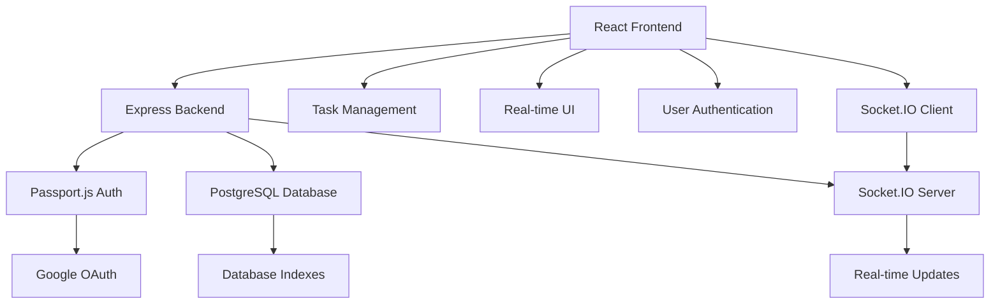

# TaskFlow - Real-time Task Management Application

A modern, full-stack task management application with real-time collaboration features. Built with React, Node.js/Express, PostgreSQL, and TypeScript.

## 🚀 Features

### Core Functionality
- **User Authentication**: Google OAuth integration with Supabase Auth
- **Task Management**: Create, edit, delete, and organize tasks with priorities and due dates
- **Real-time Collaboration**: Live updates when tasks are modified by team members
- **Task Sharing**: Share tasks with other users via email with read/write permissions
- **Advanced Filtering**: Filter tasks by status, owner, due date, and completion
- **Search**: Real-time search across all tasks
- **Responsive Design**: Optimized for mobile, tablet, and desktop

### Technical Features
- **Real-time Updates**: WebSocket-based live updates using Supabase Realtime
- **Row Level Security**: Secure data access with Supabase RLS policies
- **Type Safety**: Full TypeScript implementation with generated database types
- **Modern UI**: Clean, professional interface with Tailwind CSS
- **Error Handling**: Comprehensive error handling with toast notifications
- **Performance**: Optimized queries and efficient state management

## 🛠️ Tech Stack

### Frontend
- **React** with TypeScript
- **Vite** for build tooling
- **Tailwind CSS** for styling
- **React Router** for navigation
- **React Hot Toast** for notifications
- **Lucide React** for icons
- **Date-fns** for date formatting

### Backend & Database
- **Node.js** with Express framework
- **PostgreSQL** database with proper indexing
- **Socket.IO** for real-time updates
- **Passport.js** for Google OAuth authentication
- **JWT** for session management

### Deployment
- **Frontend**: Netlify/Vercel  
- **Backend**: Railway/Fly.io
- **Database**: NeonDB/Supabase PostgreSQL

## 📁 Project Structure

```
src/
├── components/           # React components
│   ├── Dashboard.tsx     # Main dashboard view
│   ├── TaskCard.tsx      # Individual task card component
│   ├── TaskModal.tsx     # Task creation/editing modal
│   ├── ShareModal.tsx    # Task sharing modal
│   ├── LoginPage.tsx     # Authentication page
│   └── ProtectedRoute.tsx # Route protection wrapper
├── contexts/            # React context providers
│   ├── AuthContext.tsx   # Authentication state management
│   └── TaskContext.tsx   # Task state management
├── lib/                 # Utility libraries
│   ├── api.ts           # API client for backend communication
│   └── socket.ts        # Socket.IO client management
├── App.tsx              # Main application component
└── main.tsx            # Application entry point

server/
├── config/              # Server configuration
│   ├── database.js      # PostgreSQL connection
│   └── passport.js      # Passport.js configuration
├── middleware/          # Express middleware
│   └── auth.js          # Authentication middleware
├── routes/              # API routes
│   ├── auth.js          # Authentication routes
│   └── tasks.js         # Task management routes
├── database/            # Database schema
│   └── schema.sql       # Database schema and migrations
└── app.js              # Main server application
```

## 🗄️ Database Schema

### Tables

**profiles**
- User profile information linked to auth.users
- Stores name, email, and avatar URL

**tasks**
- Main task entity with title, description, status, priority
- Supports due dates and timestamps
- Links to task creator

**task_collaborators**
- Junction table for task sharing
- Supports read/write permissions
- Links tasks to collaborating users

### Security
- Row Level Security (RLS) enabled on all tables
- Policies ensure users can only access their own data and shared tasks
- Secure authentication with Supabase Auth

## 🚀 Getting Started

### Prerequisites
- Node.js (v18+) 
- npm or yarn
- PostgreSQL database
- Google OAuth credentials

### Installation

1. **Clone the repository**
   ```bash
   git clone <repository-url>
   cd taskflow
   ```

2. **Install dependencies**
   ```bash
   npm install
   ```

3. **Set up PostgreSQL Database**
   - Create a PostgreSQL database named `todo_db`
   - Create a user `todo_user` with password `securepassword`
   - Run the schema file: `psql -U todo_user -d todo_db -f server/database/schema.sql`

4. **Configure environment variables**
   ```bash
   # Create .env file
   DB_USER=todo_user
   DB_PASSWORD=securepassword
   DB_HOST=localhost
   DB_NAME=todo_db
   DB_PORT=5432
   
   JWT_SECRET=your-super-secret-jwt-key
   SESSION_SECRET=your-session-secret
   
   GOOGLE_CLIENT_ID=your-google-client-id
   GOOGLE_CLIENT_SECRET=your-google-client-secret
   
   PORT=3001
   FRONTEND_URL=http://localhost:5173
   ```

5. **Set up Google OAuth**
   - Go to Google Cloud Console
   - Create OAuth 2.0 credentials
   - Add `http://localhost:3001/api/auth/google/callback` as redirect URI
   - Add credentials to your .env file

6. **Run the development servers**
   ```bash
   # Run both frontend and backend
   npm run dev:full
   
   # Or run separately:
   npm run dev:server  # Backend only
   npm run dev         # Frontend only
   ```

### Database Setup

1. **Create PostgreSQL database and user**
   ```sql
   CREATE DATABASE todo_db;
   CREATE USER todo_user WITH PASSWORD 'securepassword';
   GRANT ALL PRIVILEGES ON DATABASE todo_db TO todo_user;
   ```

2. **Run the database schema**
   ```bash
   psql -U todo_user -d todo_db -f server/database/schema.sql
   ```

## 🔧 Development

### Available Scripts

```bash
npm run dev:full     # Start both frontend and backend
npm run dev:server   # Start backend only
npm run dev          # Start development server
npm run build        # Build for production
npm run lint         # Run ESLint
npm run preview      # Preview production build
```

### Key Features Implementation

#### Real-time Updates
- Uses Socket.IO for WebSocket connections
- Automatic UI updates when tasks are modified
- Efficient state management with React Context

#### Task Sharing
- Email-based user lookup
- Granular permissions (read/write)
- Real-time collaboration updates

#### Security
- JWT-based authentication
- Secure authentication flows
- Input validation and sanitization

## 🌐 Deployment

### Frontend Deployment (Netlify)
1. Build the project: `npm run build`
2. Deploy the `dist` folder to Netlify
3. Set environment variables in Netlify dashboard

### Backend (Supabase)
- Database and authentication are handled by Supabase Cloud
- No additional backend deployment required

## 📊 Architecture



## 🔐 Security Best Practices

- **Authentication**: Secure OAuth implementation with Passport.js
- **Authorization**: JWT-based session management
- **Input Validation**: Client and server-side validation
- **Error Handling**: Comprehensive error management
- **Rate Limiting**: Express rate limiting middleware
- **Security Headers**: Helmet.js for security headers

## 📈 Performance Optimizations

- **Efficient Queries**: Optimized database queries with proper indexes
- **Real-time Updates**: Efficient Socket.IO implementation
- **State Management**: Optimized React Context usage
- **Code Splitting**: Lazy loading for better performance
- **Connection Pooling**: PostgreSQL connection pooling
- **Session Management**: Efficient session storage

## 🤝 Contributing

1. Fork the repository
2. Create a feature branch
3. Make your changes
4. Add tests if applicable
5. Submit a pull request

## 📝 License

This project is open source and available under the [MIT License](LICENSE).

## 🎯 Future Enhancements

- [ ] Task templates and automation
- [ ] File attachments
- [ ] Calendar integration
- [ ] Mobile app with React Native
- [ ] Advanced analytics and reporting
- [ ] Integration with third-party tools
- [ ] Offline support with sync

## 🙏 Acknowledgments

This project is part of a hackathon run by [https://www.katomaran.com](https://www.katomaran.com)

---

**Live Demo**: [Your deployed application URL]
**Video Demo**: [Your Loom video URL]
**GitHub Repository**: [Your GitHub repo URL]